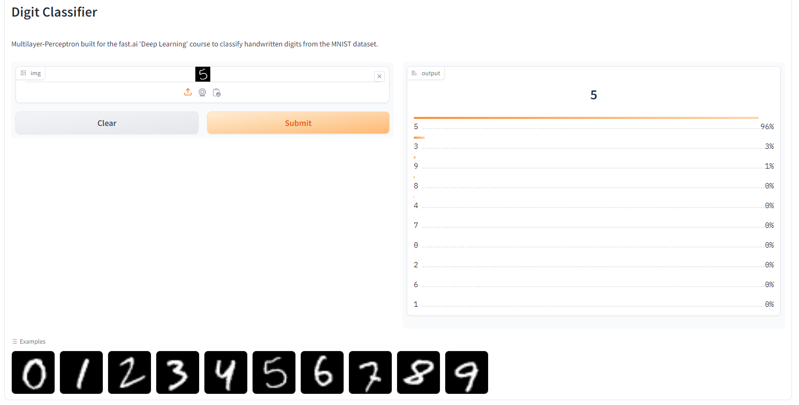

# Practical Deep Learning 

Learning Projects to Get Started with Deep Learning

## 01. Annotated Multi-Layer Perceptron

Build, Train, and Deploy a Multi-Layer Perceptron to classify handwritten Digits. It  implements from scratch the following modules: **linear layer**, **relu-activation-function**, **sequential-layer**, **flattening-layer**, **basic optimizer**, and **learner**. The model achieves 95.6% accuracy with `15 training epochs` and `batch size = 64`.

Experiment with different layer configurations, batch sizes, and training epochs. Understand the role of gradients, backpropagation, activation functions, flattening, and the importance of breaking simmetry with random parameter initialization.

[Annotated Notebook](./multi_layer_perceptron.ipynb) |
[Open in Colab](https://colab.research.google.com/github/dcarpintero/deep-learning-notebooks/blob/main/multi_layer_perceptron.ipynb) |
[Try in HuggingFace Spaces](https://huggingface.co/spaces/dcarpintero/mlp-digit-classifier) 

`[deep-learning]` `[perceptron]` `[backpropagation]` `[gradient-descend]` `[linear-layer]` `[relu]` `[optimizer]` `[mnist]` `[multi-class]` `[universal-approximation-theorem]`

  

